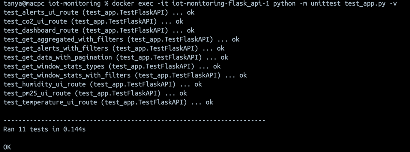

# IoT Sensor Data Processing System

This project is a distributed system for real-time ingestion, storage, analysis, and visualization of IoT sensor data. It uses MQTT, Kafka, PostgreSQL, and Flask, all orchestrated with Docker Compose.

## 🔍 Overview

**Key Features:**
- Real-time sensor data flow: MQTT → Kafka → PostgreSQL
- Microservices architecture
- REST API for querying data
- Analytics and alerting services
- Fully containerized setup

📘 **Documentation:**  
[https://oksuzova.github.io/iot-monitoring/](https://oksuzova.github.io/iot-monitoring/)

## 🛍 Architecture


## 📦 Services

| Service            | Description                              |
|--------------------|------------------------------------------|
| `mosquitto`        | MQTT broker for publishing sensor data   |
| `kafka`            | Message broker for streaming data        |
| `collector_service`| Transfers MQTT messages to Kafka         |
| `postgres_db`      | Stores raw data, analytics and alerts    |
| `flask_api`        | Exposes REST endpoints to query data     |
| `analytics_service`| Performs statistical analysis            |
| `alerts_service`   | Generates alerts based on incoming data  |

## 🚀 How to Run

### 1. Clone the Repository

```bash
git clone https://github.com/oksuzova/iot-monitoring.git
cd iot-monitoring
```

### 2. Start the System

```bash
docker-compose up --build
```

This will:
- Launch MQTT, Kafka, PostgreSQL
- Build all services (API, Analytics, Alerts, Collector)
- Automatically connect and orchestrate the data flow

### 3. Access the System

- **API & UI**: [http://localhost:5001/](http://localhost:5001/)


- **Database**: PostgreSQL running on `localhost:5432`  
  Credentials:
  ```text
  DB name: sensors  
  User: user  
  Password: password
  ```

### 4. Generate Sensor Data

You can simulate sensor data by publishing to Mosquitto manually:

```bash
mosquitto_pub -h localhost -p 1883 -t sensor/data -m '{"sensor_id": "123", "temperature": 22.5, "humidity": 40}'
```
or 

```bash
python3 sensor_script.py
```

### 5. Run the unit tests

```bash
docker exec -it iot-monitoring-flask_api-1 python -m unittest test_app.py -v
```



### 6. Sending Alerts to Telegram
You can set up alerts to be sent to your Telegram bot. 
Make sure to set the `BOT_TOKEN` and `CHAT_ID` environment variables in your `.env` file.

Alerts will be sent when sensor readings exceed predefined thresholds.

